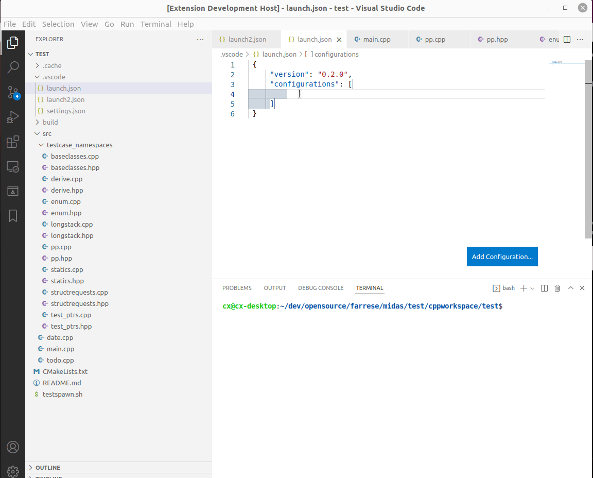
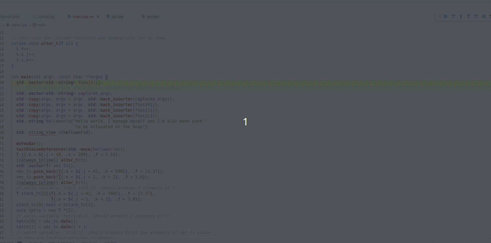

Midas is a debug adapter that utilizes the GDB/MI interface while also integrating into the experience an ease of use of [rr](https://rr-project.org/). It also aims to be as fast as GDB/rr allows for non-trivial applications and as such uses GDB's great Python integration to be faster than some debug adapters, where possible.

## Requirements

Midas is developed exclusively for GDB with Python integration in mind. If you are running a GDB which does not support it, or hasn't been built with Python functionality, Midas will not work, at all.

And as it's developed with rr in mind, Linux is also a requirement.

To check whether or not GDB has been built with Python, from a terminal write

```bash
gdb --config
```

This will give you a list of GDB features built in. In this list, something like this should be shown:

    --with-python=/usr (relocatable)
    --with-python-libdir=/usr/lib (relocatable)

Midas has been tested with the following GDB versions

- GDB 9.1, GDB 11.1 and [GDB built from source](https://www.sourceware.org/gdb/current/)
- rr 5.5.0: seeing as how this uses the GDB remote serial protocol, earlier versions should probably be fine

Currently Midas will only work for GDB versions above 9.1 due to the nature of the Python implementation of earlier GDB versions. There might be some work put into getting earlier versions to work. But it might not be possible
depending on how far back Python support exists in GDB.

## Launch configuration

We distinguish between a "normal" debug session and a "replayable debug session" by setting up the following configurations
in `launch.json` config:

### Normal debug session:

```json
{
  "type": "midas-gdb",
  "request": "launch",
  "name": "Launch Debug",
  "program": "/path/to/binary",
  "cwd": "${workspaceFolder}",
  "stopOnEntry": true,
  "trace": "Off",
  "allStopMode": true
}
```

Required values are

- type
- request: launch
- program: path/to/binary

Default values for non-required (or non-set) properties:

- trace: "Off"
- stopOnEntry: false
- allStopMode: true
- gdbPath: gdb (meaning, if gdb doesn't exist on $PATH you will have to set this)

All stop mode, means that all stop / continue actions halt or start threads in unison.

Trace has the following settings:

- "Off", no logging
- "GDB events" - gdb events are logged to the developer console
- "Python logs" - logs performance and debug messages to performance_time.log, error.log and debug.log.
- "Full" all logging turned on.

The log files will be found where the extension is installed (typically at $HOME/.vscode/extensions/...). These are currently very bare bones though.

To "run" the inferior (debugged program) in an external console, add the `externalConsole` field. Depending
on the debug session type it takes different values. For a normal debug session it might look like:

```json
    "externalConsole": {
        "path": "x-terminal-emulator",
        "closeTerminalOnEndOfSession": true,
        "endSessionOnTerminalExit": true
    }
```

rr:

```json
    "externalConsole": {
        "path": "x-terminal-emulator",
        "closeTerminalOnEndOfSession": true,
    }
```

Since the rr debug session relies on rr running, closing the terminal where it's running externally, will
end the debug session. These fields are described in the UI when setting up a launch.json.

However, currently this is only tested on Ubuntu, thus it uses `x-terminal-emulator` alias with pretty specific parameters. If your linux distro, spawns
a shell with this command, external console should work on your Linux distro as well;

`x-terminal-emulator -e sh -c "tty > /tmp/someFileMidasDecidesAtRunTime && echo $$ >> /tmp/someFileMidasDecidesAtRunTime && sleep 100000000000000"`

## Setup commands

Another field that can be added is the `setupCommands` which takes an array of strings that are GDB commands to be executed before
loading the binary or file containing symbols (the `-iex "someCommand here"`). Below is an example of such

```json
{
  "type": "midas-gdb",
  "request": "launch",
  "name": "Launch Debug",
  "program": "${workspaceFolder}/path/binary",
  "cwd": "${workspaceFolder}",
  "stopOnEntry": true,
  "trace": "Off",
  "allStopMode": true,
  "setupCommands": ["set print object on", "set auto-load safe-path /"]
}
```

## Replayable debug session (rr)

Configuration example of a rr debug session:

```json
{
  "type": "midas-rr",
  "request": "launch",
  "name": "Launch replay debug session",
  "program": "${workspaceFolder}/path/binary",
  "cwd": "${workspaceFolder}",
  "stopOnEntry": true,
  "trace": "Off",
  "gdbPath": "gdb",
  "rrPath": "rr",
  "serverAddress": "localhost:50505"
}
```

rrServerAddress defines the host and port that rr will be told to listen on, which we connect to with GDB. If this field is not set
Midas will use `127.0.0.1:RandomFreePort` which just scans for free ports in the range `50505 : uint16 MAX`.

rrPath behaves just like the gdbPath field and defaults to trying to find `rr` in `$PATH`.

However, you shouldn't have to fill out a placeholder for yourself, VSCode should be able to provide auto-completion like it normally does (default trigger usually is `ctrl` + `space`), shown below.



## Usage

Since VSCode is aimed to be as general as possible, some functionality might never be represented in the UI - as such it might appear unintuitive. [Describing such functionality is found here](docs/USAGE.md), like setting watch points, formatting displayed values etc. It's recommended to skim through, to get to know useful Midas features.

If Midas behaves strangely, there exists a midas command (`Create github issue log`) that aims to make reports easier to file. It creates a new virtual document with the error logs. Please use this when filing a issue. It gets the `rr` and `gdb` version from the `launch.json` configuration of the active running debug session you've provided and also tries to figure out the Linux distro you are using. To access this midas command open the control panel (default shortcut for VSCode is `ctrl+shift+P`). and type `Create github issue". Example below.
. Either save this file and add it to the issue or paste it into the issue itself. This command needs to be executed while the debug session is active & running in order for it to work. The logs it copies from are non-persistent to not swamp your file system.

## Development

To package extension, run the alias
`yarn package` or `vsce package --yarn` (vsce needs to be installed; `npm install -g vsce`)

## Changelog

Can be [found here](docs/CHANGELOG.md)

## Known bugs

Can be [found here](docs/BUGS.MD)
