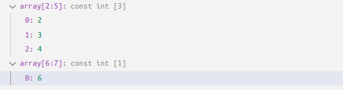
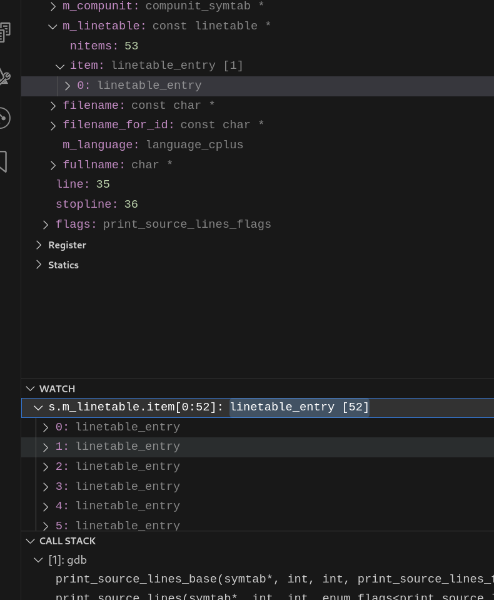

# Usage

- [Setting watchpoints](#setting-watchpoints)
- [Watch variables](#watch-variables)
- [Find first operator](#find-first)
- [Hexadecimal watch variable formatting](#hexadecimal-format-of-watch-variables)
- [Watch variable subscript](#watch-variable-subscript)

You can use GDB/rr from the debug console in VSCode as normal. No prefix commands with -exec etc, just type whatever commands you want. Notice however, that some commands might alter GDB state which might _not_ be seen by Midas, so if you ever come across a command that breaks Midas or make Midas behave strange, please be so kind and report it so that edge cases can be handled.

## Setting watchpoints

Right click the variable in the variable window and pick the menu option for what watch point you want to set. The watchpoints are always set by address (location).

The reasoning behind this, is that the re-evaluation of watch points when new scopes are entered will slow them down. Doing this defeats the purpose of fast hardware watchpoints.

## Watch variables

Since the VSCode UI for Watch Variables isn't extendable as of now, the design decision has been to add "keywords" that change the output of the watch variable contents. These are described here. In the future
a context menu will be added, for a more clearer use. Example shown below for how it works.

## Hexadecimal format of watch variables

Unfortunately VSCode provides no good way to format individual values (due to not being fully DAP-compliant), so for now you can only toggle hex formatting for all variables on display. Right click in the "Variables" pane during
a debugging session and click "Toggle hex formatting":

## Watch variable subscript

This feature has been disabled for now. For normal pointers, you can use `foo[0]@10` to get 10 elements of foo (starting at position 0) - i.e. the same way you would, using GDB from the command line. Due to re-factor, subscripting into pretty printed values has been disabled to be able to re-introduce it in newer versions. Documentation is left in, as I expect this feature to work exactly the same in future versions.

The best approach to analyze arrays (of type `T[]`) using Midas debug adapter is to add them to the watch variables list with the desired range. This is achieved by writing
`foo[N:M]` (or `foo[N]` for single elements). VSCode currently does not honor the "paging" of variables but even if it did, this is still the preferable approach, since paging in variables still would mean you would have to expand until you reach `N:M`.

This feature comes with some limitations and can even cause GDB to hang due to how pretty printers work. This is described in [bugs](./BUGS.MD). If it does, use the `cancel` command described below.
Pretty printers read values from the type, and thus, if the user enters a range of values where some doesn't exist, the Python Pretty printer might interpret arbitrary data as that type
and can produce all kinds of strange behaviors, like for instance thinking a `std::vector` has billions of elements.

This feature is _particularly_ useful in use with variable length types. Below is an example from working on some GDB code:

## Debug Console - Midas Specific commands

- cancel - Writing `cancel` in the console sends an interrupt to GDB causing it to cancel any operation it is doing (similar to the `ctrl+c` when using GDB on the command line). If GDB is stalled or doing something that is taking too long (like running a python command or something of that nature) this will cancel that operation.
