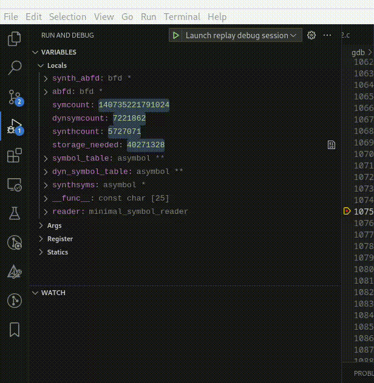
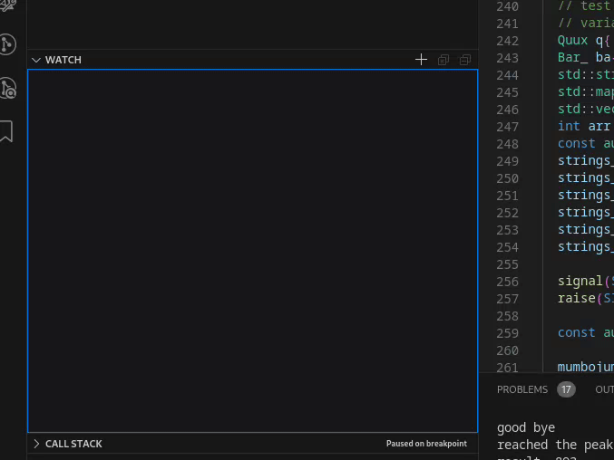

# Usage

- [Setting watchpoints](#setting-watchpoints)
- [Watch variables](#watch-variables)
- [Find first operator](#find-first)
- [Hexadecimal watch variable formatting](#hexadecimal-format-of-watch-variables)
- [Watch variable subscript](#watch-variable-subscript)

You can use GDB/rr from the debug console in VSCode as normal. No prefix commands with -exec etc, just type whatever commands you want. Notice however, that some commands might alter GDB state which might _not_ be seen by Midas, so if you ever come across a command that breaks Midas or make Midas behave strange, please be so kind and report it so that edge cases can be handled.

## Setting watchpoints

Right click the variable in the variable window and pick the menu option for what watch point you want to set. The watchpoints are always set by address (location).

The reasoning behind this, is that the re-evaluation of watch points when new scopes are entered will slow them down. Doing this defeats the purpose of fast hardware watchpoints.

## Watch variables

Since the VSCode UI for Watch Variables isn't extendable as of now, the design decision has been to add "keywords" that change the output of the watch variable contents. These are described here. In the future
a context menu will be added, for a more clearer use. Example shown below for how it works.

## Hexadecimal format of watch variables

Unfortunately VSCode provides no good way to format individual values (due to not being fully DAP-compliant), so for now you can only toggle hex formatting for all variables on display. Right click in the "Variables" pane during
a debugging session and click "Toggle hex formatting":

## Watch variables

To add a contiguous set of variables to to watch (for instance they're behind some pointer or array), the syntax is the same as in GDB's command line: `*foo@10` (dereference foo and take 10 elements).

## Debug Console - Midas Specific commands

- cancel - Writing `cancel` in the console sends an interrupt to GDB causing it to cancel any operation it is doing (similar to the `ctrl+c` when using GDB on the command line). If GDB is stalled or doing something that is taking too long (like running a python command or something of that nature) this will cancel that operation.
