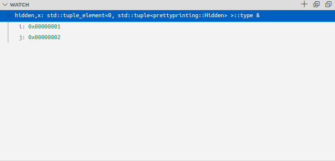

# Usage

You can use GDB/rr from the debug console in VSCode as normal. No prefix commands with -exec etc, just type whatever commands you want. Notice however, that some commands might alter GDB state which might _not_ be seen by Midas, so if you ever come across a command that breaks Midas or make Midas behave strange, please be so kind and report it so that edge cases can be handled.

## Setting watchpoints

Right click the variable in the variable window and pick the menu option for what watch point you want to set. The watchpoints are always set by address (location).

The reasoning behind this, is that the re-evaluation of watch points when new scopes are entered will slow them down. Doing this defeats the purpose of fast hardware watchpoints.

## Hexadecimal format of watch variables

If you want the watch variables to be formatted as hexadecimal, append `,x` to the expression. This will format the value and any of it's possible children as hexadecimal.

